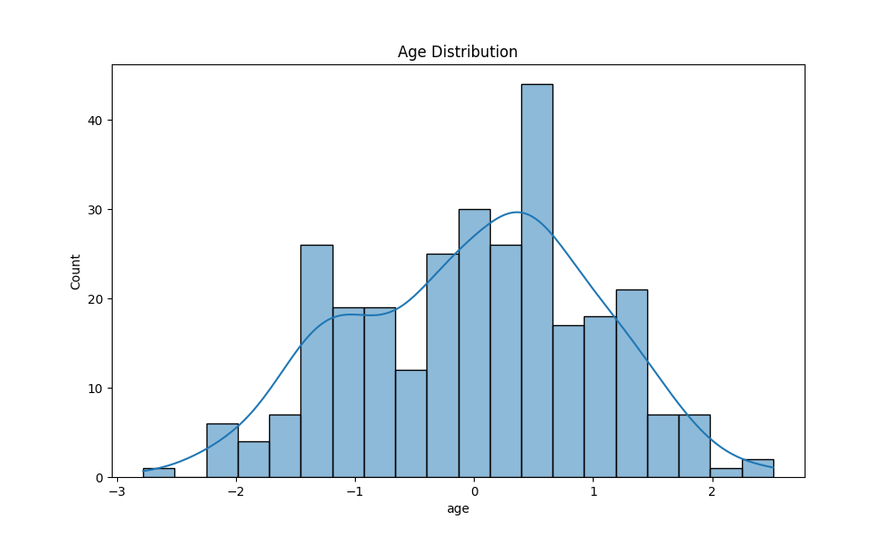
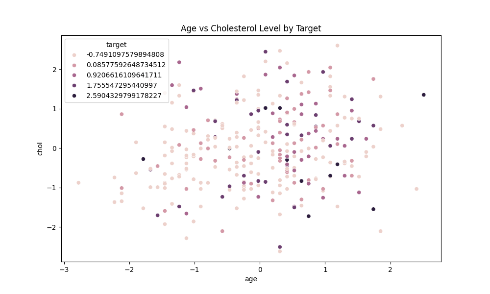
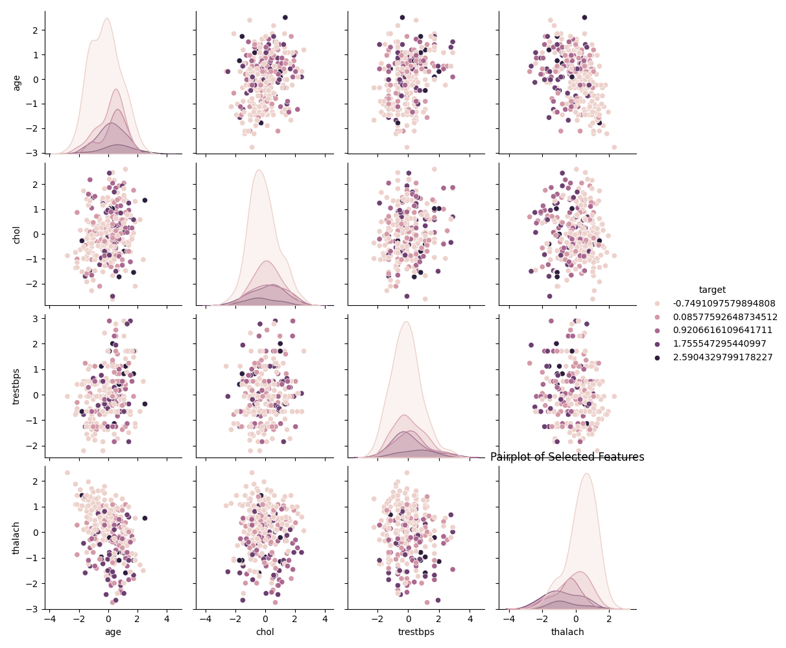
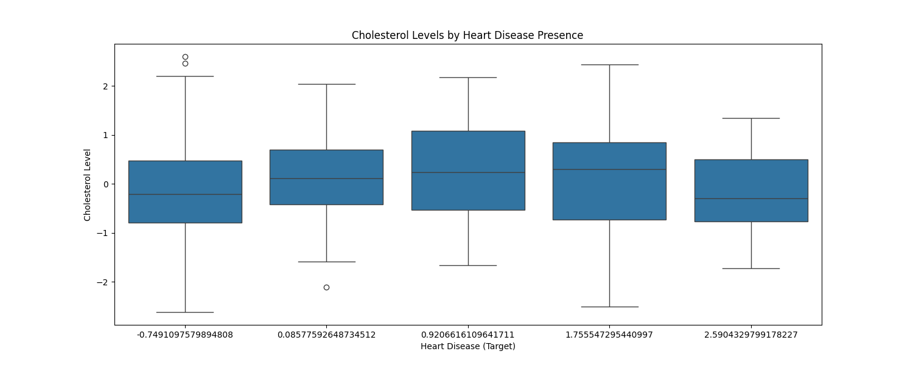
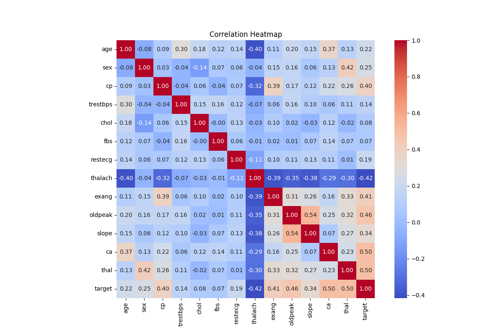
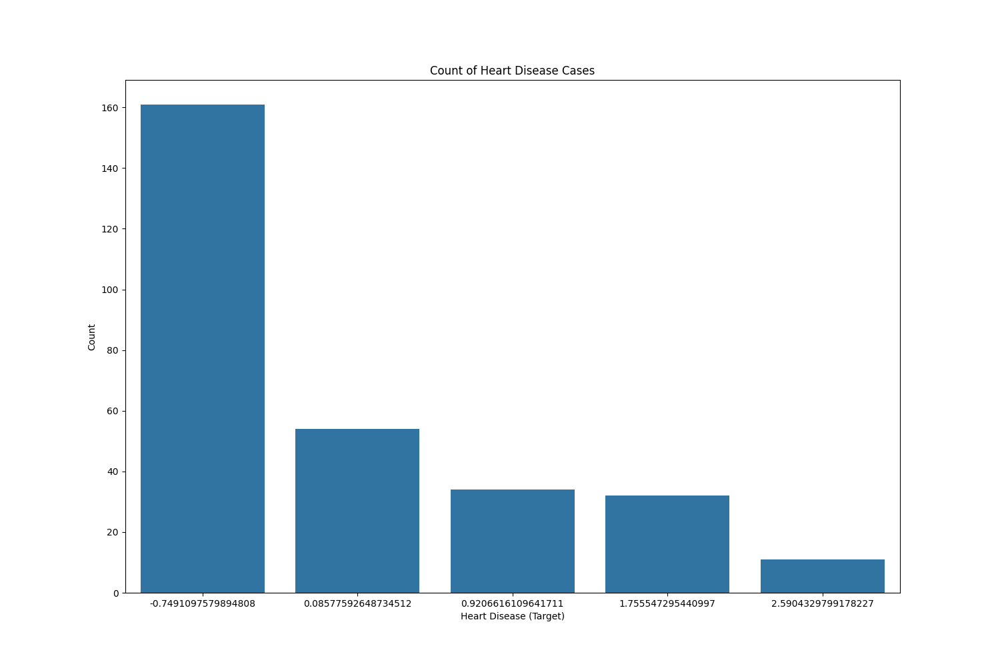
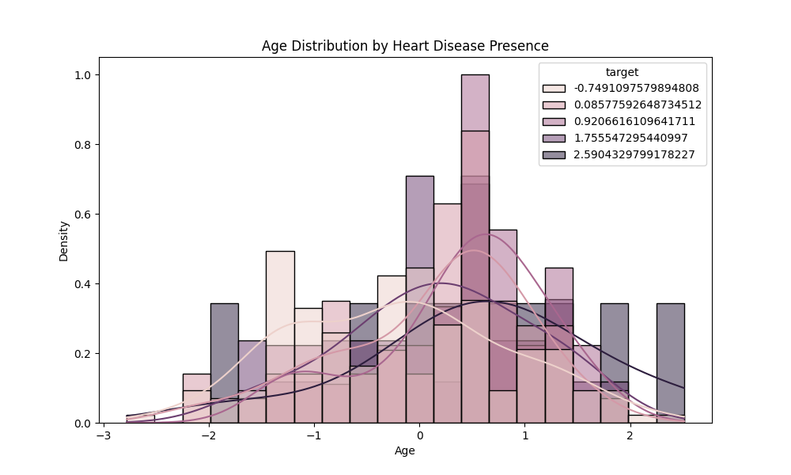
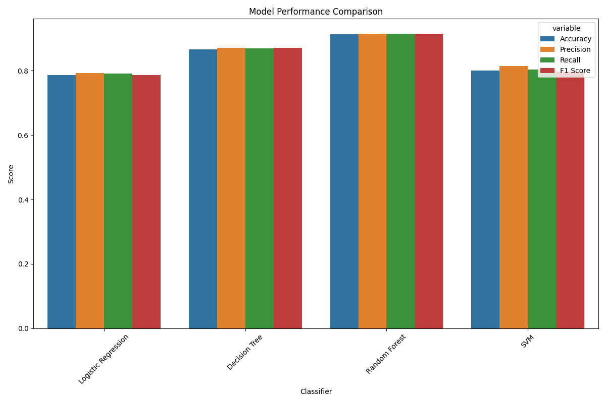

# Heart Disease Classification Project

## Objective
To integrate and apply advanced data analysis and machine learning techniques on the Heart Disease Dataset from the UCI Machine Learning Repository, demonstrating a comprehensive understanding of the data science workflow.

## Table of Contents
- [Dataset Selection and Loading](#part-1-dataset-selection-and-loading)
- [Data Preprocessing](#part-2-data-preprocessing)
- [Data Visualization](#part-3-data-visualization)
- [Feature Selection](#part-4-feature-selection)
- [Modeling with Supervised Classifiers](#part-5-modeling-with-supervised-classifiers)
- [Visualizing Model Performance](#part-6-visualizing-model-performance)
- [Report Findings](#part-7-report-findings)

## Part 1: Dataset Selection and Loading

We utilized the **Heart Disease Dataset**, a multi-feature dataset often used for classifying the presence of heart disease.

```python
import pandas as pd
import numpy as np

# Load dataset
url = 'https://archive.ics.uci.edu/ml/machine-learning-databases/heart-disease/processed.cleveland.data'
columns = ['age', 'sex', 'cp', 'trestbps', 'chol', 'fbs', 'restecg', 'thalach', 'exang', 'oldpeak', 'slope', 'ca', 'thal', 'target']
data = pd.read_csv(url, header=None, names=columns)

# Check dataset structure
print("Data Shape:", data.shape)
print(data.info())
data.head()
```

## Part 2: Data Preprocessing

1. **Cleaning**: Handle missing values, duplicates, and outliers.
2. **Encoding**: Convert categorical data into numerical using one-hot encoding.
3. **Normalizing and Scaling**: Scale numerical features for improved model performance.
4. **Balancing**: Address class imbalance using SMOTE (Synthetic Minority Over-sampling Technique).

```python
# Replace '?' with NaN
data.replace('?', np.nan, inplace=True)
data = data.apply(pd.to_numeric, errors='coerce')
data.fillna(data.median(), inplace=True)
data.drop_duplicates(inplace=True)
outlier_condition = (np.abs(zscore(data.select_dtypes(include=np.number))) < 3).all(axis=1)
data = data[outlier_condition]
scaler = StandardScaler()
data[data.columns] = scaler.fit_transform(data)

# Prepare features and target
X = data.drop('target', axis=1)
y = data['target']

# Balancing classes using SMOTE
smote = SMOTE(random_state=42)
X_resampled, y_resampled = smote.fit_resample(X, y)
```

## Part 3: Data Visualization

Various visualizations were created to understand the distributions of features and their relationships with the target variable.

### Visualizations
- **Age Distribution**


- **Age vs Cholesterol Level by Target**


- **Pairplot of Selected Features**


- **Cholesterol Levels by Heart Disease Presence**


- **Correlation Heatmap**


- **Count of Heart Disease Cases**


- **Age Distribution by Heart Disease Presence**


## Part 4: Feature Selection

Used different feature selection methods:

1. **Filter Method**: Correlation matrix to check feature correlation with the target variable.
2. **Wrapper Method**: Recursive Feature Elimination (RFE).
3. **Embedded Method**: Lasso Regression to penalize less important features.

```python
# Selected features by RFE
print("Selected features by RFE:", selected_features)

# Selected features by Lasso
print("Selected features by Lasso:", lasso_features)
```

## Part 5: Modeling with Supervised Classifiers

Implemented and evaluated multiple classifiers, including Logistic Regression, Decision Tree, Random Forest, and SVM.

```python
# Train-test split
X_train, X_test, y_train, y_test = train_test_split(X_resampled[selected_features], y_resampled, test_size=0.2, random_state=42)

# Classifiers and performance metrics
classifiers = {
    "Logistic Regression": LogisticRegression(),
    "Decision Tree": DecisionTreeClassifier(),
    "Random Forest": RandomForestClassifier(),
    "SVM": SVC(kernel='linear')
}

# Evaluate each classifier
for name, clf in classifiers.items():
    clf.fit(X_train, y_train)
    y_pred = clf.predict(X_test)
    # Calculate performance metrics...
```

## Part 6: Visualizing Model Performance

Plot performance metrics for each classifier.



## Part 7: Report Findings

### Summary:
1. **Analysis Pipeline Steps**:
   - Used the Heart Disease Dataset from UCI, cleaned it, normalized features, and addressed class imbalance with SMOTE.
   - Created visualizations for insights into data distributions and relationships.
   - Selected features using RFE and Lasso regression.
   - Implemented Logistic Regression, Decision Tree, Random Forest, and SVM, evaluating their performance using various metrics.

2. **Impact of Techniques on Model Performance**:
   - Feature scaling and encoding were essential for model effectiveness.
   - SMOTE improved evaluation reliability by balancing class distribution.

3. **Classifier Strengths and Recommendations**:
   - **Logistic Regression**: Good for interpretability but lower accuracy (78.67%).
   - **Decision Tree**: Higher accuracy (86.67%) but prone to overfitting.
   - **Random Forest**: Best overall (91.33% accuracy), robust against overfitting.
   - **SVM**: Moderate performance (80.00%).

**Recommendation**: The **Random Forest** model is recommended for its high accuracy and robustness, making it valuable for clinical decision-making in heart disease diagnosis.
